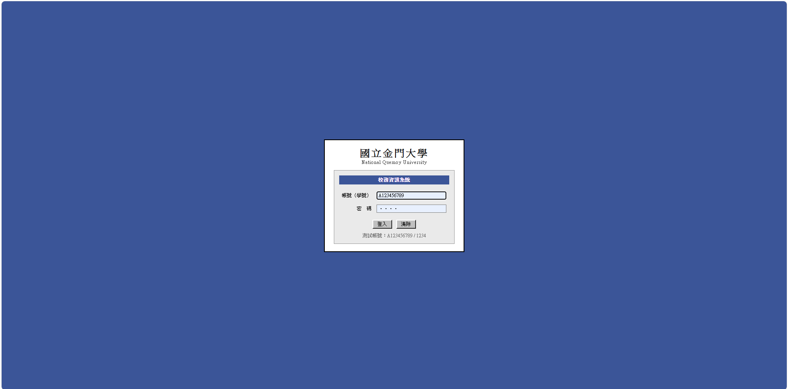
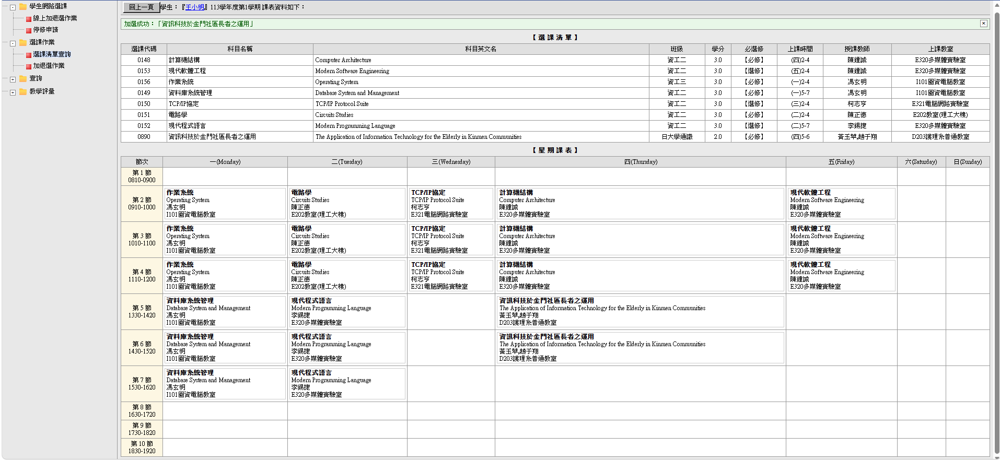
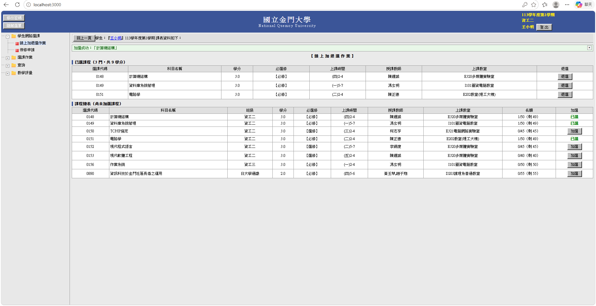
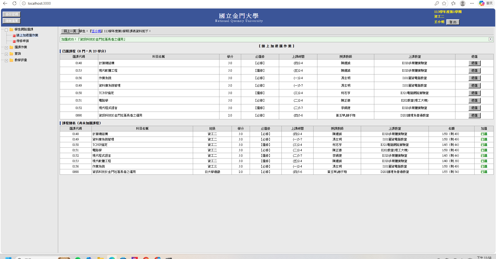
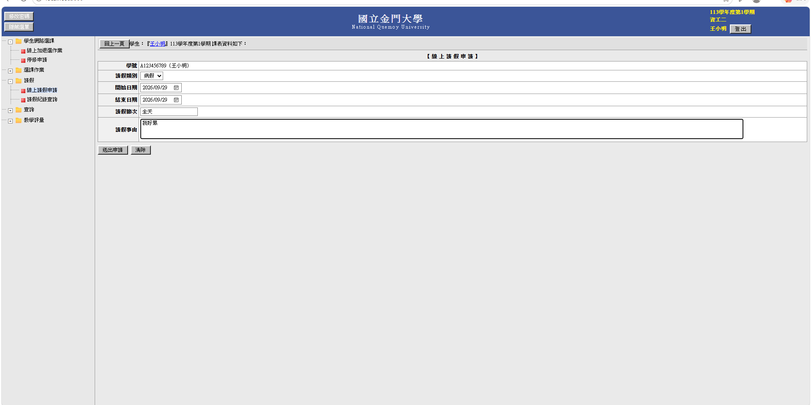
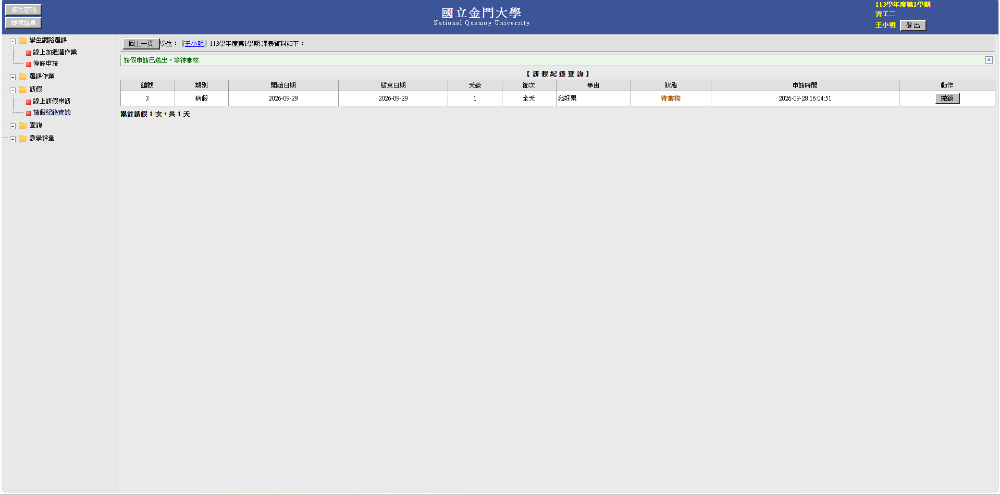
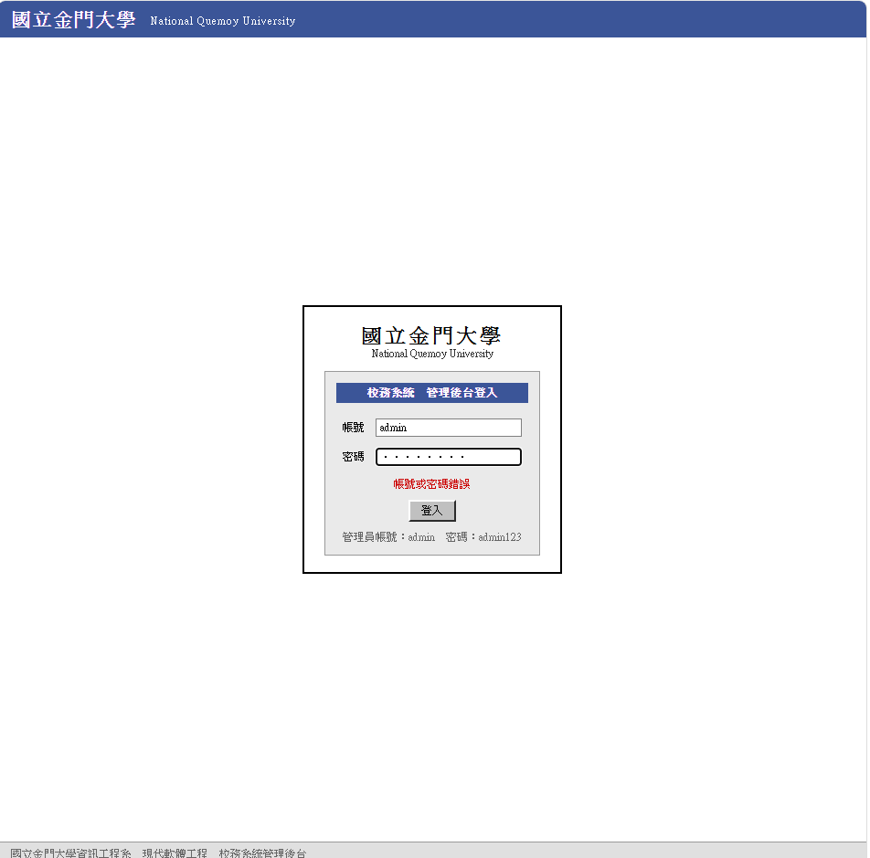
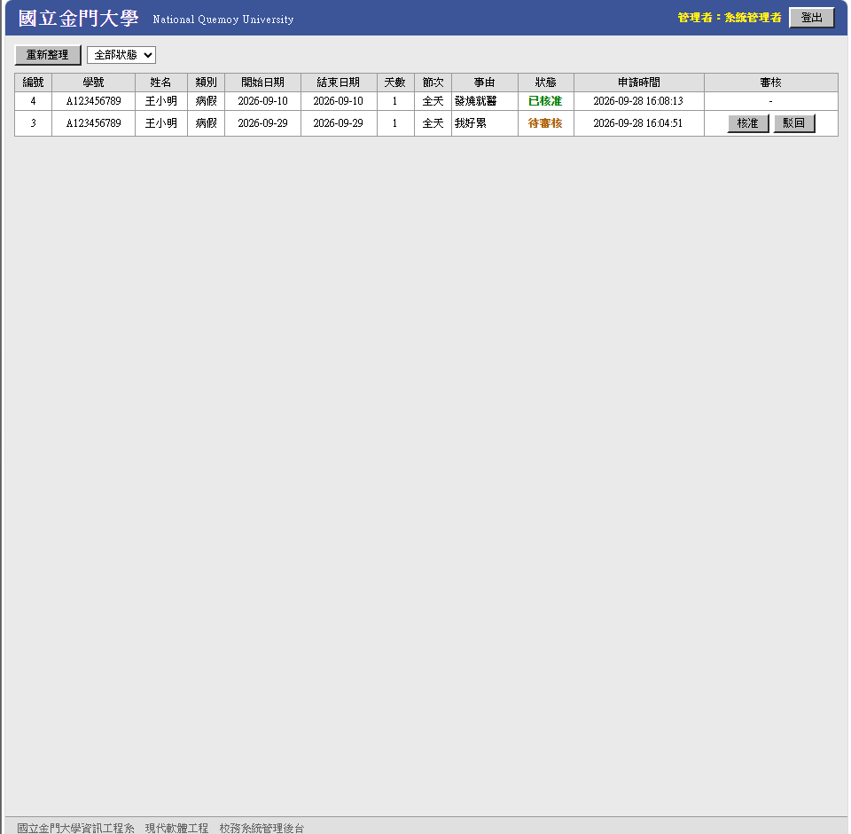
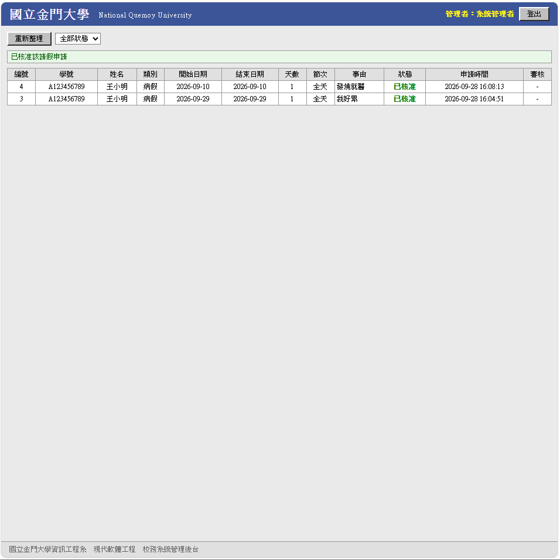

# HW2 大學校務資訊系統

> 115 學年上學期｜現代軟體工程 HW2｜國立金門大學資工系｜學號 43

以 **Flask + SQLite** 實作後端、**原生 HTML/JavaScript**（另有 **React** 對照版）實作前端的一個校務系統示範程式，涵蓋**登入分流、個人課表、線上加退選、學生請假與管理員審核**完整流程。

## 功能總覽

* **帳號登入**：依據帳號身分分流為「學生」與「管理員」兩種介面
* **個人課表查詢**：依 `student_id + semester` 撈出該學期「已選上」的課程清單，並繪製星期課表
* **線上加退選作業**：加選前檢查重複選課與課程名額，退選以軟刪除方式保留歷史紀錄
* **學生請假申請**：送出假單後狀態預設「審核中」，支援病假／事假／公假／喪假／其他
* **管理員後台審核**：列出所有待審核假單，可一鍵「已批准」或「退回」，且不可重複審核

## 技術架構

| 層級 | 技術 | 說明 |
|------|------|------|
| 後端 | Python `Flask 3.0` + `flask-cors` | 提供 RESTful API |
| 資料庫 | `SQLite`（`backend/data/university.db`） | 首次啟動自動建立資料表與測試資料 |
| 前端 | 後端樣板 `templates/index.html`、`templates/enroll.html`（原生 JS） | 直接由 Flask 提供 |
| 對照版前端 | `frontend/`（React 18 + axios） | 相同功能的獨立實作 |
| 開發學期 | `113-1` | 於 `config.py` 的 `CURRENT_SEMESTER` 設定 |

### 資料表結構

* `students`：學生主檔
* `courses`：課程主檔（含名額 `max_capacity`、已選人數 `current_enrolled`）
* `course_enrollments`：選課歷程（`status` 記錄「已選上／退選」）
* `grades`：學期成績
* `leave_requests`：請假單（`status`：審核中／已批准／退回）
* `users`：登入帳號（`student`／`admin`）

## 快速開始

### 1. 啟動後端（必須）

```bash
cd backend
pip install -r requirements.txt
python app.py
```

啟動後開啟 **http://localhost:5000**，第一次執行會自動建立資料庫並填入測試資料。

### 2. 啟動 React 前端（選用，與後端樣板二擇一）

```bash
cd frontend
npm install
npm start
```

啟動後開啟 **http://localhost:3000**。

## 測試帳號

| 身分 | 帳號 | 密碼 |
|------|------|------|
| 學生 | `student` | `123456` |
| 管理員 | `admin` | `123456` |

種子資料另有一位學生 **王小明（A123456789）**，可登入後直接檢視課表、加退選與請假流程。

### 可加選課程（種子資料）

| 課程代號 | 課程名稱 | 學分 | 類型 | 授課教師 |
|----------|----------|------|------|----------|
| CS101 | 程式設計 | 3 | 必修 | 王教授 |
| CS201 | 資料結構 | 3 | 必修 | 李教授 |
| CS301 | 資料庫系統 | 3 | 必修 | 陳教授 |
| CS401 | 人工智慧導論 | 3 | 選修 | 林教授 |

## API 一覽

| 方法 | 路徑 | 說明 |
|------|------|------|
| `POST` | `/api/login` | 登入驗證，回傳身分 `role`（student / admin） |
| `GET` | `/api/schedule?student_id=&semester=` | 查詢個人課表（僅已選上的課） |
| `POST` | `/api/enroll` | 加選課程（含重複選課／名額檢查） |
| `DELETE` | `/api/enroll` | 退選課程（軟刪除） |
| `POST` | `/api/leave` | 學生送出請假單 |
| `GET` | `/api/admin/leaves` | 管理員列出待審核假單 |
| `PUT` | `/api/admin/leaves/<id>` | 管理員審核（已批准／退回） |

## 程式截圖

### 登入與課表

| 登入畫面 | 我的課表 |
|----------|----------|
|  |  |

### 線上加退選作業

| 加選前畫面 | 加選後畫面 |
|------------|------------|
|  |  |

### 學生請假

| 學生請假畫面 | 學生請假申請送出 |
|--------------|------------------|
|  |  |

### 管理員後台審核

| 後台登入畫面 | 請假批准前 | 請假批准成功 |
|--------------|------------|--------------|
|  |  |  |

## 專案結構

```
HW2/
├── backend/
│   ├── app.py               # Flask 應用程式入口（註冊藍圖）
│   ├── config.py            # 資料庫路徑與目前學期設定
│   ├── database.py          # SQLite 連線／通用 query、execute
│   ├── init_db.py           # 建立資料表與種子資料
│   ├── requirements.txt     # 相依套件（Flask、flask-cors）
│   ├── routes/
│   │   ├── auth.py          # /api/login 登入驗證
│   │   ├── schedule.py      # 課表、加選、退選
│   │   └── leave.py         # 學生請假、管理員審核
│   ├── templates/           # index.html（登入/課表/請假/後台）+ enroll.html（加退選）
│   ├── static/styles.css    # 後端樣板樣式
│   └── data/university.db   # SQLite 資料庫（執行時自動建立）
├── frontend/                # React 對照版前端
├── image/                   # 程式功能截圖
└── README.md
```

## 設計與防呆重點

* **重複選課檢查**：同一學生、同課程、同學期不得重複加選
* **名額控管**：`current_enrolled >= max_capacity` 時拒絕加選
* **軟刪除退選**：退選僅將 `status` 改為「退選」，保留完整選課歷史，且不可重複退選
* **審核防呆**：已審核完畢（已批准／退回）的假單不可重複審核
* **身分分流**：登入後依 `role` 切換學生／管理員畫面與授權 API